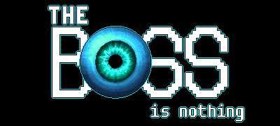

---
title: Games
layout: default
--- 
  <h2>
    Our Games
  </h2>
  
There are the games that are either completed or still in development.

  

    

      

        
        <h3 class="blue-text">The BOSS</h3>
        
The BOSS: A Jacksepticeye Fan Game

      

      

        
        <h3 class="blue-text">Glitch in The System</h3>
        
A sequel to The BOSS

      

      

        
        <h3 class="blue-text">The BOSS is Nothing</h3>
        
The DLC for The BOSS

      

      

        
        <h3 class="blue-text">Spark</h3>
        
Original game in pre-development stages

      

    

  
