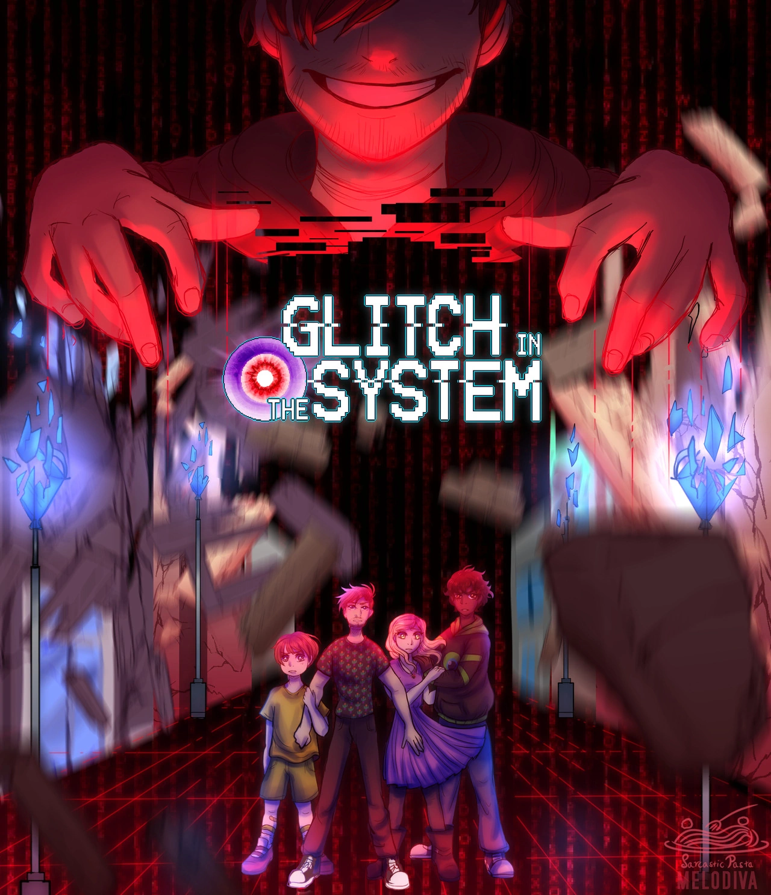

---
title: Sarcastic Pasta Games
layout: default
--- 

<ol class="carousel-indicators">
  <li data-target="#carouselIndicators" data-slide-to="0" class="active"></li>
  <li data-target="#carouselIndicators" data-slide-to="1"></li>
  <li data-target="#carouselIndicators" data-slide-to="2"></li>
  <li data-target="#carouselIndicators" data-slide-to="3"></li>
</ol>

  

    
  

  

    
  

  

    
  

  

    
  

<a class="carousel-control-prev" href="#carouselControls" role="button" data-slide="prev">
  &#5193;
</a>
<a class="carousel-control-next" href="#carouselControls" role="button" data-slide="next">
  &#8250;
</a>

<h2>Sarcastic Pasta Games</h2>

  
Originally founded to create <i>THE BOSS, a Jacksepticeye Fan Game,</i>Sarcastic
    Pasta Games has

  
branched out to become its very own game company. It is run by a
    variety of brand new game
developers, united by their passion for well-written,
  story driven games.

 